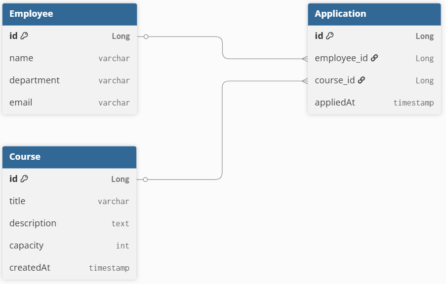

# 1. 패키지 구조

``` plain Text
Project
└── com.example.eduapp
    ├── domain
    │   ├── Employee.java
    │   ├── Course.java
    │   └── Application.java
    ├── repository
    │   ├── EmployeeRepository.java
    │   ├── CourseRepository.java
    │   └── ApplicationRepository.java
    ├── controller
    ├── service
    ├── dto
    │   ├── request
    │   └── response
    └── exception
```

# 2. ERD



# 3. API 문서

[REST API.pdf](../../../Users/GGG/Downloads/REST%20API.pdf)


